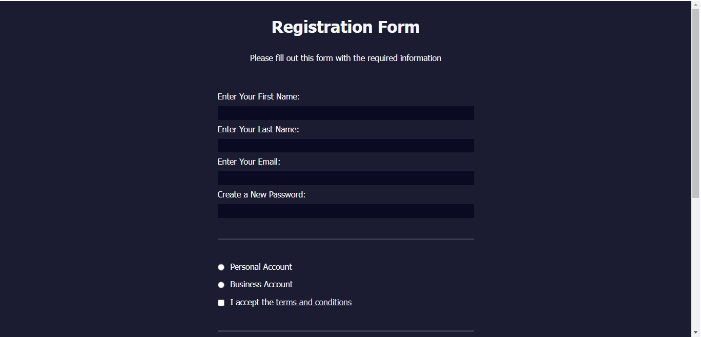
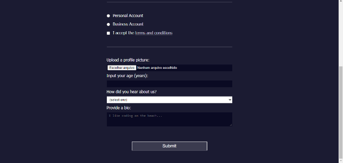
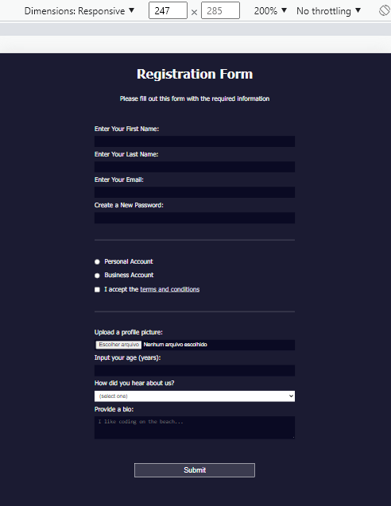

<h1 align='center'>Registration Form</h1>

  <a href="#-sobre">Sobre</a>&nbsp;&nbsp;&nbsp;|&nbsp;&nbsp;&nbsp;
  <a href="#-prints">Prints</a>&nbsp;&nbsp;&nbsp;|&nbsp;&nbsp;&nbsp;
  <a href="#-tecnologias">Tecnologias</a>&nbsp;&nbsp;&nbsp;|&nbsp;&nbsp;&nbsp;
  <a href="#-licença">Licença</a>&nbsp;&nbsp;&nbsp;|&nbsp;&nbsp;&nbsp;

🚀 Projeto concluído ✅

## 💻 Sobre

É uma página de cadastro simples feita usando HTML e CSS. O projeto foi desenvolvido durante um tutorial da [freeCodeCamp](https://www.freecodecamp.org/) no curso de [design web responsivo](https://www.freecodecamp.org/learn/2022/responsive-web-design), porém com algumas modificações. 

## 📷 Prints

 

## 🛠 Tecnologias

- Linguagens: 
    - [HTML](https://developer.mozilla.org/pt-BR/docs/Web/HTML) 
    - [CSS](https://developer.mozilla.org/pt-BR/docs/Web/CSS)
- Ferramentas 
    - Editor: [Visual Studio Code](https://code.visualstudio.com/)

## 📝 Licença 

O projeto está sob a [Licensa MIT](./LICENSE) 

Qualquer pessoa pode usar, clonar e contribuir com este projeto ✌ 
